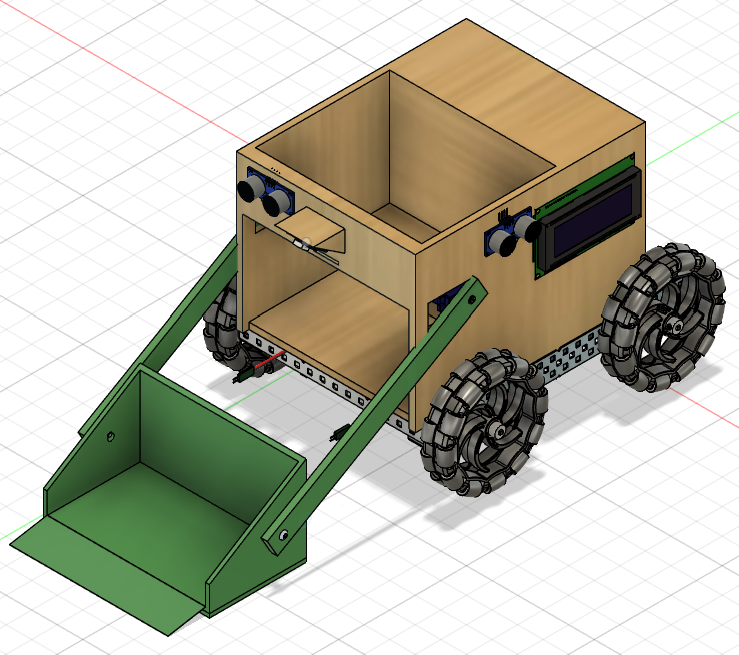
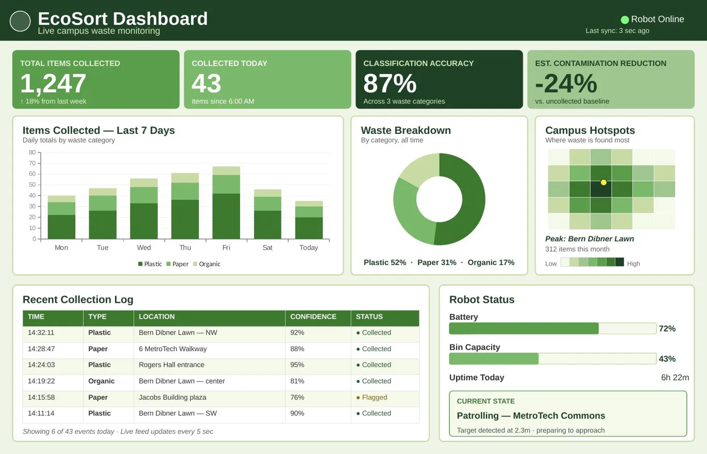
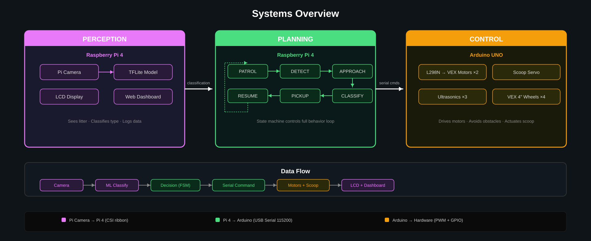

# EcoSort

**Autonomous waste-classification robot built on a Raspberry Pi 4 + Arduino UNO dual-processor stack, deploying a MobileNetV2 TensorFlow Lite classifier for on-device inference.**

EcoSort patrols a designated area, detects litter through ultrasonic sensors and a Pi Camera, classifies waste as plastic, paper, or organic using on-device machine learning, actuates a 3D-printed scoop to collect the item, and logs every event to a real-time Flask analytics dashboard.

Built over a 14-week semester at NYU Tandon by Adam Gosine.

---


*Mecanum-wheel chassis with rear-mounted electronics bay (Pi 4, Arduino, L298N), front dustpan-style scoop driven by twin servo arms, and an external LCD status display. Built on a VEX skeleton with 3D-printed PLA scoop/arms and laser-cut wood housing.*
## Demo

Coming soon.

---

### Live Dashboard



The Flask analytics dashboard updates in real time as the robot patrols and classifies waste. Tracks daily totals, classification accuracy, waste-type breakdown, campus hotspots, and live event log per detection.
## What's in this repo

```
ecosort/
├── perception/         # Raspberry Pi 4 — Python control + ML inference
│   ├── main.py             # Main FSM: patrol → detect → classify → collect → log
│   ├── dashboard.py        # Flask analytics dashboard
│   ├── requirements.txt    # Python dependencies
│   └── model.tflite        # MobileNetV2 classifier (3-class waste model)
├── firmware/           # Arduino UNO — real-time motor + sensor control
│   └── ecosort_arduino.ino
├── docs/               # Architecture diagrams, circuit, flowchart
└── cad/                # 3D model references
```

---

## Architecture

| Layer | Hardware | Software | Responsibility |
|---|---|---|---|
| **Perception** | Raspberry Pi 4 + Pi Camera | TensorFlow Lite, OpenCV, MobileNetV2 | Captures frames, runs on-device ML inference at ~12 FPS, classifies waste into plastic / paper / organic |
| **Planning** | Raspberry Pi 4 | Python finite state machine | Manages the patrol → detect → approach → classify → collect → log loop |
| **Control** | Arduino UNO + L298N H-bridge + 3× HC-SR04 + 2× DS3225 servos | Arduino C++ (Servo.h, NewPing.h, Wire.h) | Real-time motor control, ultrasonic obstacle polling at sub-50ms intervals, servo actuation, LCD status display |

The Pi and Arduino communicate over USB serial at 9600 baud. The Pi sends high-level commands (`FWD`, `STOP`, `TURN_L`, `SCOOP_OPEN`) and the Arduino executes them with PWM signals.

<p align="center">
  
</p>

## Wiring at a glance

- **Pi 4 ↔ Arduino UNO:** USB serial @ 9600 baud
- **Pi Camera ↔ Pi 4:** CSI ribbon
- **Arduino ↔ L298N:** PWM (D5, D6, D11) for motor speed/direction
- **L298N ↔ VEX 393 motors:** OUT1-4, powered by 7.2V VEX NiMH battery
- **Arduino ↔ HC-SR04 ×3:** D2/D4/D7 trigger, A0/A1/A2 echo
- **Arduino ↔ DS3225 servos:** D3, D8 PWM
- **Arduino ↔ LCD 16×2:** I2C via SDA/SCL

Full pin-level details available in `firmware/ecosort_arduino.ino`.

## Bill of materials

| Component | Quantity | Purpose |
|---|---|---|
| Raspberry Pi 4 (4GB) | 1 | Perception + planning |
| Pi Camera Module v2 | 1 | RGB image capture |
| Arduino UNO R3 | 1 | Real-time motor control |
| L298N motor driver | 1 | H-bridge for VEX motors |
| HC-SR04 ultrasonic sensor | 3 | Obstacle detection (left, center, right) |
| DS3225 servo motor | 2 | Scoop arm actuation |
| VEX 393 motor | 2 | Wheel drive |
| VEX chassis kit | 1 | Structural skeleton |
| LCD 16x2 (I2C) | 1 | Status display |
| USB power bank (5V 3A) | 1 | Pi power |
| 7.2V VEX NiMH battery | 1 | Motor power |
| 3D-printed PLA components | — | Scoop, arm extensions, mounts |
| Wood (laser-cut) | — | Bin housing |

Total project value: ~$300. Out-of-pocket cost: ~$80 (the rest sourced from institutional inventory at NYU Tandon's OpenLab).

---

## Software stack

**Raspberry Pi (Python 3, Raspberry Pi OS):**
- `tensorflow-lite-runtime` — on-device inference
- `opencv-python` — image preprocessing, frame differencing, baseline subtraction
- `picamera2` — camera capture
- `pyserial` — Pi ↔ Arduino communication
- `flask` — analytics dashboard

**Arduino UNO (Arduino IDE 2.3, C++):**
- `Servo.h` — scoop arm PWM control
- `NewPing.h` — ultrasonic distance polling
- `Wire.h` — I2C communication for LCD

---

## Results

- **Classification accuracy:** 70-90% across plastic, paper, and organic waste classes
- **Inference rate:** ~12 FPS on Raspberry Pi 4 
- **Obstacle response latency:** <50 ms ultrasonic poll-to-stop
- **Dashboard update latency:** ~1 second from classification event to browser refresh
- **Demo:** Successfully patrolled, detected, classified, and collected plastic, paper, and organic waste samples on a 30-second test run

---

## Running the system

### Pi side

Install Python dependencies:
```bash
pip install -r perception/requirements.txt --break-system-packages
```

Enable the camera interface via `raspi-config`. Place `model.tflite` in `perception/`.

To run the full system:
```bash
cd perception
python3 dashboard.py &
python3 main.py
```

Open `http://<pi-ip>:5000` in a browser to view the dashboard.

To demo the dashboard alone (no robot required):
```bash
python3 test_demo.py
```

### Arduino side

Open `firmware/ecosort_arduino.ino` in the Arduino IDE, select the Arduino UNO board, and upload. The Arduino will accept serial commands from the Pi over USB at 9600 baud.

---

## Future Work

- Expand the classifier from 3 to 6+ waste categories (metal, glass, e-waste)
- Migrate from VEX educational chassis to a commercial-grade aluminum frame
- Integrate the dashboard with sustainability reporting frameworks (AASHE STARS)
- Pilot deployment with NYU Sustainability via the NYU Prototyping Fund

---
NYU Tandon · General Engineering · EG-UY 1004 Section H2 · Spring 2026
---

## License

MIT — see [LICENSE](LICENSE).
